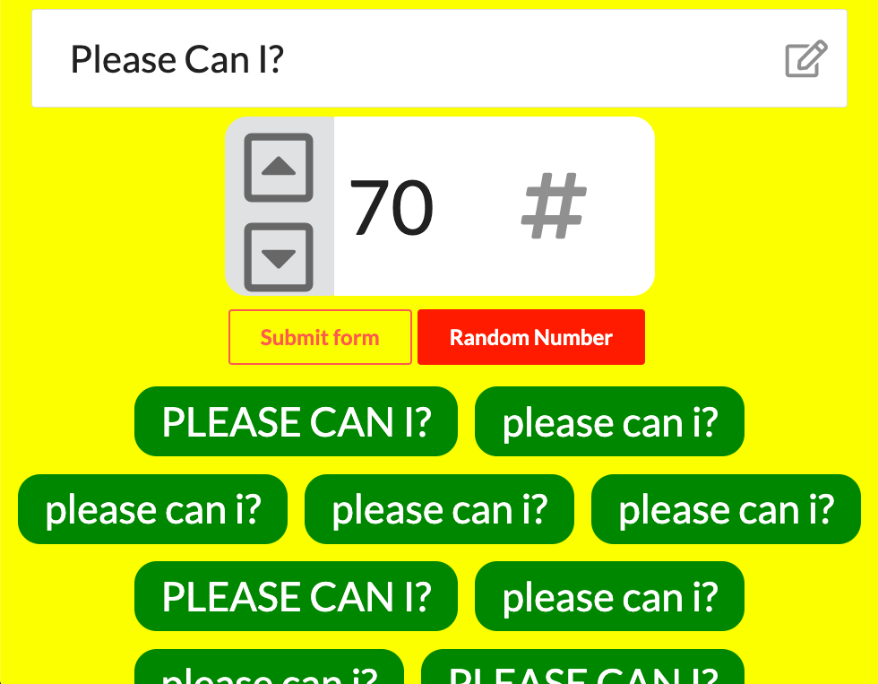

# Please Can I
Date Created: 02/04/20 | Date Modified: 02/04/20

<!-- [![Netlify Status]]() -->

*This assignment is an exercise: [Directions here](directions.md)*

Preview assignment here: https://trinity-please-can-i.netlify.com/

***

## Description: 
- This application takes the user's text input, or plea, and number input. The plea will be written to the DOM many times as the user chooses in the number input.

## Features

- The random button chooses a random number between 1 and 100 for the number of repetitions the plea will be printed to DOM.

- Random pleas will appear as uppercase on the DOM.

## Validation

- If the user tries to submit and the value of the plea is empty or just full of spaces, a modal will showup asking the user to "Please type a plea in the textbox"

- If the user tries to input a number in the number field that is greater than 100, the input value will be corrected to 100, and the up arrow button is disabled.

- If the user tries to input a number in the number field that is less than 100, the input value will be corrected to 1, and the down arrow button is disabled.

- The up arrow button will be made available after the value of the input is less than 100.

- The down arrow button will be made available after the value of the input is more than 1.

